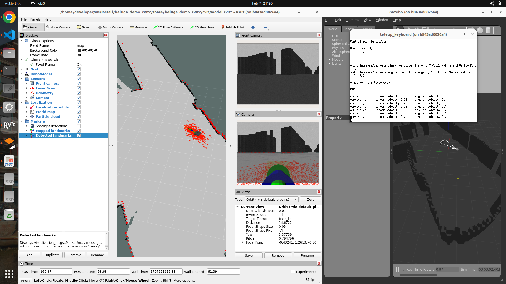

# Beluga demos!

Here you will find minimal, interactive demos to test the capabilities of the Beluga library.

> [!NOTE]
> The Beluga library is not included in this repository.
> You can find the official `beluga` project in the [https://github.com/Ekumen-OS/beluga](https://github.com/Ekumen-OS/beluga) repository.

https://github.com/Ekumen-OS/beluga-demos/assets/17802342/7058c34b-491d-4931-a90e-3c5f97b033a5

## Pre-requisites

**This guide assumes you are using a Linux system with a working Docker installation.** You can check if this is the case by running the following command in a terminal:

```bash
docker run hello-world
```

If you don't have Docker installed, you can find instructions on how to install it [here](https://docs.docker.com/get-docker/). Instructions for installing Docker on Ubuntu can be found [here](https://docs.docker.com/engine/install/ubuntu/).

## Quick start

#### Step 1: Clone the repository
The first step is to clone the repository:

```bash
git clone git@github.com:Ekumen-OS/beluga-demos.git
```

#### Step 2: Run the docker container

Step into the repository directory and start the docker image. The first time you run the docker container, the image will be built first; this build process may take a few minutes.

```bash
cd beluga-demos
ROSDISTRO=humble docker/run.sh  # ROS2 Humble
ROSDISTRO=jazzy docker/run.sh   # ROS2 Jazzy
```

#### Step 3: Build the demo software code

If this step succeeds you'll be inside the docker container. Now you need to build the demo software stack and run one of the demos.

```bash
demo_build
```

#### Step 4: Run a demo

Finally, run one of the demos. You can run them by typing their names in the terminal. For instance, the following command will run the `lidar_likelihood_model_hallway_demo` demo:

```bash
lidar_likelihood_model_hallway_demo
```

You'll find a list of the predefined demos in a table in the section below.

Once the demo starts you'll see three windows pop up (see the screen capture below):

- Gazebo simulation running the robot and the simulated world around it.
- RViz visualization showing sensor input values, pose estimation, particle filter belief, maps, etc.
- A small terminal that you can use to move the robot around (upper-left corner on the screen capture)

These windows can bee seen in the following screen capture on the right-hand side (Gazebo), left-hand side (RViz), and upper-right corner (terminal).



You can close the demo by pressing `Ctrl+C` in the terminal where you initially started it.

## Available demos

This table contains the list of predefined demos that you can run:

| Alias command                        | Distro | Description                                                                                                                                                                                                                                                                                                                                                            |
| ------------------------------------ | --------------------------------------------- | ------------------------------------------------------------------------------------------------------------------------------------------------------------------------------------------------------------------------------------------------------------------------------------------------------------------------- |
| `lidar_beam_model_hallway_demo`    | Humble | Demo using the [_beluga_amcl_](https://github.com/Ekumen-OS/beluga/tree/main/beluga_amcl) node to localize in a world built out of  the [Cartographer Magazino](https://github.com/magazino/cartographer_magazino?tab=readme-ov-file#data) dataset map. The node is configured to use the `beam` sensor model configuration.                                           |
| `lidar_likelihood_model_hallway_demo`| Humble | Demo using the [_beluga_amcl_](https://github.com/Ekumen-OS/beluga/tree/main/beluga_amcl) node to localize in a world built out of  the [Cartographer Magazino](https://github.com/magazino/cartographer_magazino?tab=readme-ov-file#data) dataset map. The node is configured to use the `likelihood` sensor model configuration.                                     |
| `lidar_beam_model_office_demo`       | Humble | Demo using the [_beluga_amcl_](https://github.com/Ekumen-OS/beluga/tree/main/beluga_amcl) node moving around a large office cluttered with unmapped obstacles. The configured sensor model is `beam`.                                                                                                                                                                  |
| `lidar_likelihood_model_office_demo` | Humble | Demo using the [_beluga_amcl_](https://github.com/Ekumen-OS/beluga/tree/main/beluga_amcl) node moving around a large office cluttered with unmapped obstacles. Sensor model is `likelihood`.                                                                                                                                                                           |
| `apriltags_localization_demo`        | Humble | Simple custom localization node using the `beluga` library to localize the robot within a large $10m \times 10m$ area using Apriltag markers as landmarks. The code of this localization node can be found within this repository [here](https://github.com/Ekumen-OS/beluga-demos/blob/main/localization/beluga_demo_fiducial_localization/src/beluga_lmcl_demo.cpp). |
| `light_beacons_localization_demo`    | Humble | Simple custom localization node using the `beluga` library to localize the robot within a large $10m \times 10m$ area using light sources as landmarks. The code of this localization node can be found within this repository [here](https://github.com/Ekumen-OS/beluga-demos/blob/main/localization/beluga_demo_bearing_localization/src/beluga_bmcl_demo.cpp).     |
| `nav2_integration_demo`              | Humble | Demo using the [_beluga_amcl_](https://github.com/Ekumen-OS/beluga/tree/main/beluga_amcl) node in lieu of the [_nav2_amcl_](https://github.com/ros-navigation/navigation2/tree/main/nav2_amcl) in a [Nav2](https://docs.nav2.org/) stack to navigate around a large office cluttered with unmapped obstacles.
| `amcl3_localization_demo`              | Jazzy | Custom 3D localization node using the [_beluga_vdb_](https://github.com/Ekumen-OS/beluga/tree/main/beluga_vdb) library to localize the robot in a botanic garden [dataset](https://github.com/robot-pesg/BotanicGarden). The code of this localization node is based on `OpenVDB` and can be found within this repository [here](https://github.com/Ekumen-OS/beluga/blob/main/beluga_vdb/include/beluga_vdb/sensor/likelihood_field_model3.hpp).                                                          |

## Under the hood

Under this hood this repository is a ROS 2 workspace with a few packages and a custom Docker image that contains all the dependencies needed to run the demos.

The usual ROS 2 tooling can be used to build, launch and examine the demos inside the Docker container, if so desired.

The `demo_build` alias command is a wrapper around the `colcon` build tool that builds the workspace and sources it. It's equivalent to running the following commands:

```bash
# Humble
cd ~/ws
colcon build --symlink-install
source install/setup.bash

# Jazzy
cd ~/ws
colcon build --symlink-install --cmake-args -DCMAKE_BUILD_TYPE=Release
source install/setup.bash
```

The individual demo alias commands are just wrappers around the `ros2 launch` command. For instance, the `lidar_likelihood_model_hallway_demo` alias is equivalent to running the following command after having built the workspace:

```bash
ros2 launch beluga_demo_lidar_localization demo_hallway_likelihood_localization.launch.py
```

The full list of available aliases can be found in [this file](https://github.com/Ekumen-OS/beluga-demos/blob/main/docker/files/DOTaliases).
