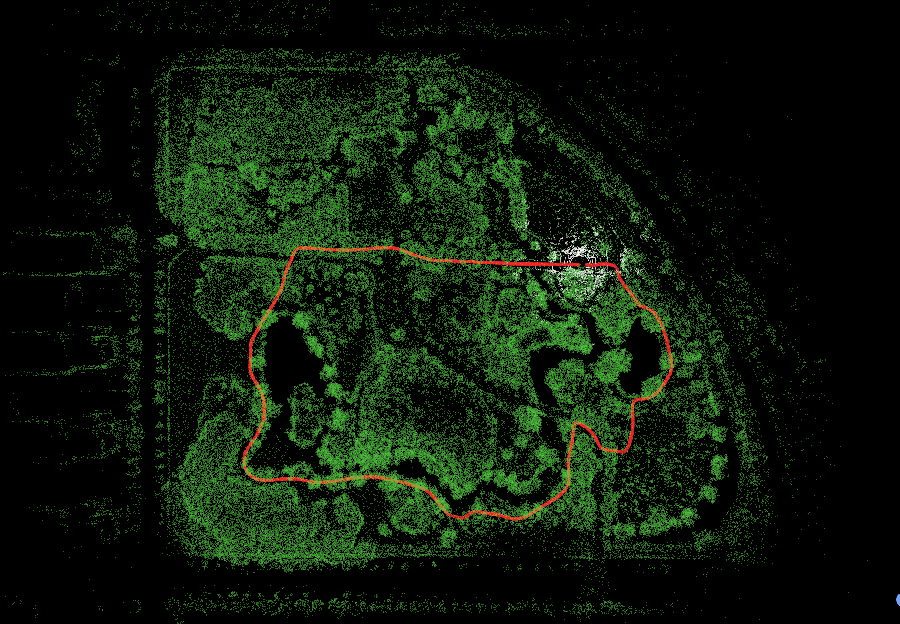
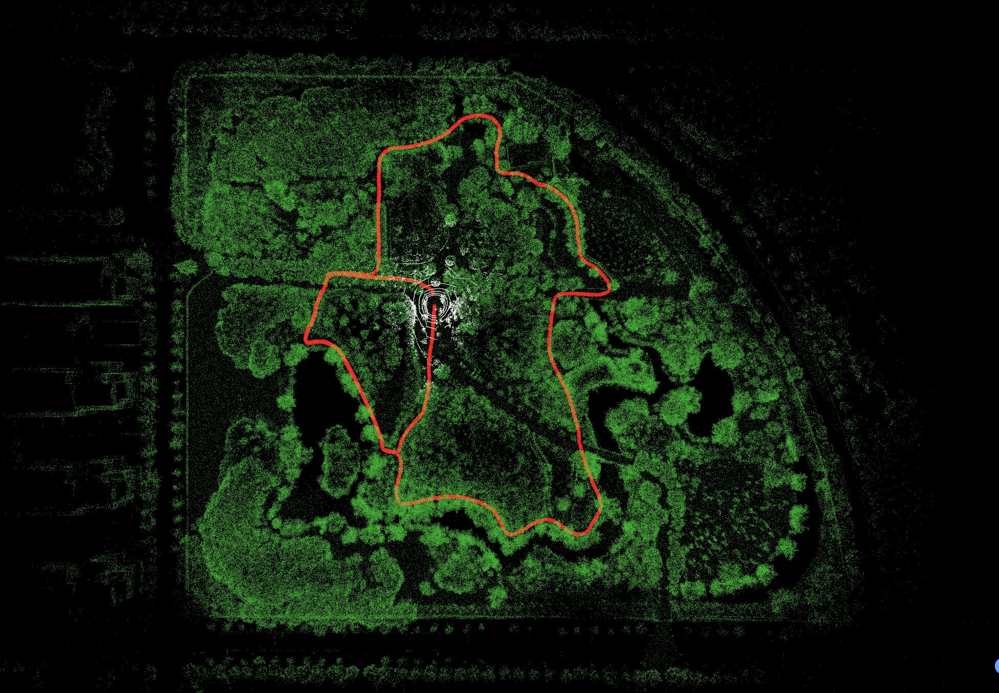
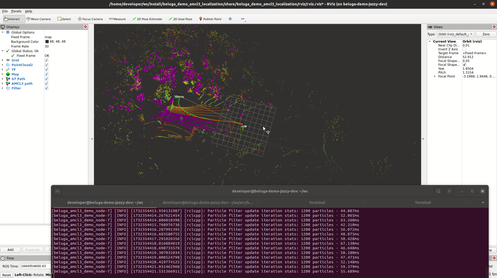

# Beluga VDB: AMCL3 Localization Demo!

This package provides 2 maps based on the [botanic garden dataset](https://github.com/robot-pesg/BotanicGarden). The rosbags from the botanic garden dataset were modified (`/odom` topic was added and several topics were removed) to be able to run on this demo. Currently, only 2 sequences can be tested: 1005-07 and 1006-01.

<div align="center">


</div>

## Pre-requisites

#### Request map and bags from the team

Request the maps and bags from the team and store the maps under `beluga_demo/localization/beluga_demo_amcl3_localization/maps` and the bags under `beluga_demo/localization/beluga_demo_amcl3_localization/rosbags`.

## Quick start

#### Step 1: File verification

Start the container with `ROSDISTRO=jazzy docker/run.sh` and verify that you have the following file structure:

```bash
    beluga_demo_amcl3_localization/
    ├── maps/
    │   ├── map_1005_07.vdb
    │   └── map_1006_01.vdb
    ├── rosbags/
    │    ├── botanic_garden_tf_1005_07/
    │    │   ├── botanic_garden_tf_1005_07.db3
    │    │   └── metadata.yaml
    │    └── botanic_garden_tf_1006_01/
    │        ├── botanic_garden_tf_1006_01.db3
    │        └── metadata.yaml
    ├── doc/
    ├── launch/
    ├── rviz/
    ├── scripts/
    └── src/
```

#### Step 2: Build the demo software code

Now you need to build the demo software stack:

```bash
demo_build
```

#### Step 3: Launch the AMCL3 node

You can now launch the AMCL3 node and Rviz using:

```bash
amcl3_localization_demo
```

#### Step 4: Run the bag

Finally, play the rosbag:

```bash
ros2 bag play ~/ws/src/beluga_demo/localization/beluga_demo_amcl3_localization/rosbags/botanic_garden_tf_1005_07/botanic_garden_tf_1005_07.mcap --clock
```

Once the bag starts playing you'll see that Rviz shows the pointcloud, pose estimation, particle filter belief, etc (see the screen capture below):



You can stop the demo by pressing `Ctrl+C` in the terminal where rviz and the rosbag are running.

## Maps

To test a different map the following variable in `src/beluga_amcl3_demo.cpp` must be changed accordingly:

```cpp
  const std::string kMapFile = ament_index_cpp::get_package_share_directory("beluga_demo_amcl3_localization") + "/maps/map_1005_07.vdb";
```
